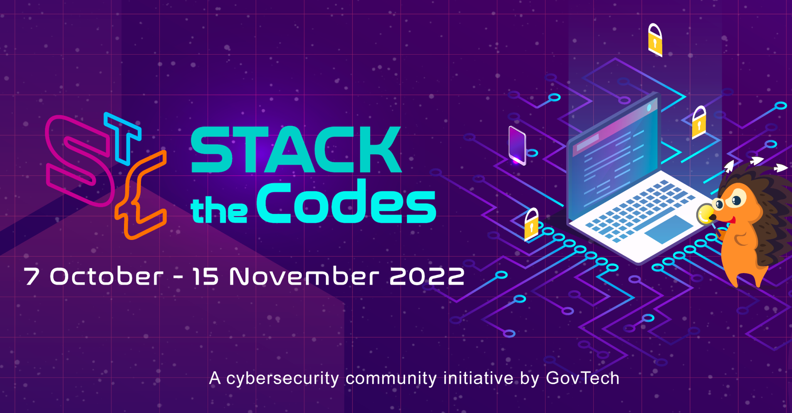

# STACK the Codes 2022

## [Problem Statement 3](./ProblemStatement.pdf):
mTLS is a much needed baseline for Zero-Trust as a whole. However, its PKI setup requires heavy operational
investment and resources from agencies which also  includes the management of the key lifecycle from provisioning to renewal to revocation.
If any of the stages are not handled timely, the impact is  rippled to the web services and may bring down the
business in worst case.

The emergence of SPIFFE issuing X.509 SVID also means  that whole setup need some form of “transformation” into
mesh network and sidecar driven setup (towards a K8  architecture). Challenge is whether there is an optimal (and
yet secure) translation from existing PKI to SPIFFE or an  alternative to achieve a reasonable identity-based attestation level.

## Submission:
- [Demo video](https://drive.google.com/file/d/1hKaoQRDpVi8gBgra6oVC9HnPfGsSNlFM/view?usp=sharing)
- Overview: we demo a full transition from legacy PKI to mTLS with SPIFFE
  - Stage 0: Microservices in Docker with TLS from a local Certificate Authority [spireplash/pki/README.md](./pki/README.md)
  - Stage 1: Migrating to Kubernetes [spireplash/k8s/README.md](./k8s/README.md)
  - Stage 2: Adopting Envoy sidecar architecture and using X.509 SVIDS by SPIFFE for mTLS [spireplash/envoy/README.md](./envoy/README.md)
- Optimization consideration: 
  - Using Ansible and Shell scripting to automate transition
- Security consideration:
  - No hard-code of password required during the whole process
  - Manage file permission to avoid running command as sudo user
  - Use of Kubernetes secret for TLS during Stage 1 transitioning
  - Serve Tornjak GUI for SPIRE on HTTPS

## Future work:
- Setup [Kubespray](https://github.com/kubernetes-sigs/kubespray) for multi-clusters deployment
- Use an [UpstreamAuthority plugin](https://spiffe.io/docs/latest/deploying/spire_server/) to integrate with existing PKI infrastructure
- [MERN stack](https://www.mongodb.com/languages/mern-stack-tutorial) transition use case

## Acknowledgment:
- Tran Nguyen Bao Long [@TNBL265](https://github.com/TNBL265)
- Ivan Feng [@IvanFengJK](https://github.com/IvanFengJK)
- Ryan Toh [@Rye123](https://github.com/Rye123)