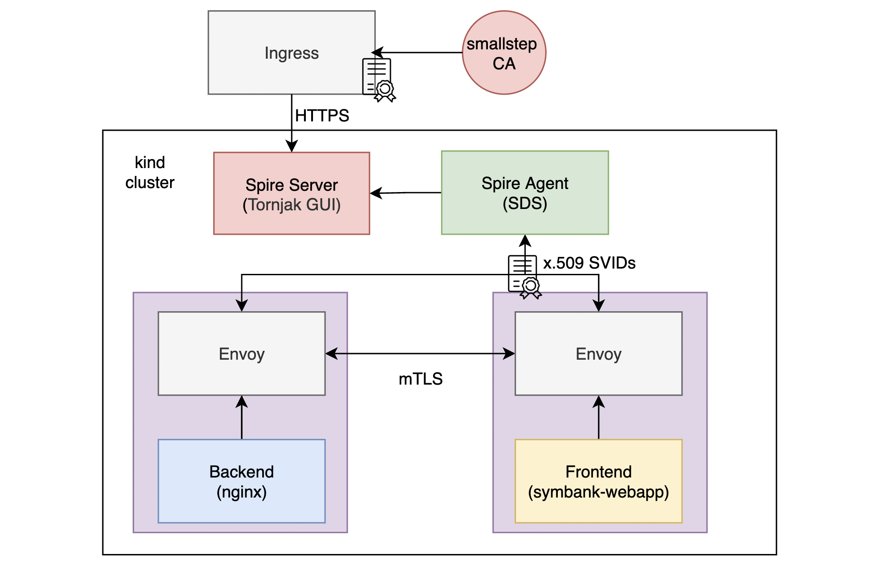

# mTLS with SPIFFE

## Stage 2: Adopting Envoy sidecar architecture and using X.509 SVIDS by SPIFFE for mTLS (Automated)

- Create TLS to serve Tornjak GUI on HTTPS
  ```shell
  cd ~/spiresplash/pki/certs
  mkdir -p tornjak && cd tornjak
  step ca certificate tornjak.com tornjak.crt tornjak.key
  
  # Allow read permission
  sudo chmod 644 tornjak.*
  ```
- Deploy SPIRE with Tornjak GUI
  ```shell
  cd ~/spiresplash
  source ~/spiresplash/ansible_venv/bin/activate
  python3.9 -m ansible playbook \
    -i ./ansible/inventories/inventory.ini \
    -e @./ansible/inventories/overrides.yml -b -v \
    ./ansible/site.yaml -t "spire,nginx"
  deactivate
  ```
- Open Tornjak GUI at https://tornjak.com to your manage your cluster (you might want to import smallstep's 
`root_ca.crt` to your browser, located at spireplash/pki/certs/root_ca.crt)
- Create node registration entry
  ```shell
  ~/spiresplash/k8s/spire/create-node-registration-entry.sh
  ```
- Run [spiresplash/scripts/setup-envoy.sh](../scripts/setup-envoy.sh) to:
  - use [mikefarah/yq](https://github.com/mikefarah/yq) to merge [envoy plugin](../envoy/plugin) yaml into 
  the k8s configuration file (in `spiresplash/k8s/pki`) created by kompose during Stage 1.
  - edit the symbank-webapp frontend configuration file in [spiresplash/envoy/plugin/frontend/config](./plugin/frontend/config) 
  with new Envoy Upstream and Downstream port then copy over to our PKI demo directory
  - remove TLS for nginx backend in both frontend and backend `Dockerfile`
  ```shell
  cd ~/spiresplash
  scripts/setup-envoy.sh
  ```
- Build new docker images and push to local registry
  ```shell
  docker rmi -f localhost:5001/frontend
  docker rmi -f localhost:5001/backend
  
  cd ~/spiresplash/pki
  docker-compose build --no-cache
  
  docker push localhost:5001/frontend
  docker push localhost:5001/backend
  ```
- Create config map for Envoy and Spire with kustomize
  ```shell
  kubectl apply -k ~/spiresplash/envoy/plugin/.
  ```
- Redeploy the "no longer" PKI-demo with Envoy for mTLS
  ```shell
  kubectl apply -f ~/spiresplash/k8s/pki
  ```
- Create registration entries using [spiresplash/envoy/create-registration-entries.sh](./create-registration-entries.sh)
  ```shell
  ~/spiresplash/envoy/create-registration-entries.sh
  ```
- Port-forward and check the SPIFFE demo at http://localhost:3000
  ```shell
  export FRONTEND_POD=`kubectl get po -o jsonpath='{.items[1].metadata.name}'`
  kubectl port-forward $FRONTEND_POD 3000:3000
  ```
- Try to delete SPIFFE ID entry of the symbank-webapp frontend using the Tornjak GUI, it won't be able to 
retrieve the data anymore after reload
  ```shell
  kubectl scale deployment frontend --replicas=0
  kubectl scale deployment frontend --replicas=1
  ```
- You can also add back the SPIFFE ID entry
  ```shell
  kubectl exec -n spire spire-server-0 -c spire-server -- \
    /opt/spire/bin/spire-server entry create \
    -parentID spiffe://example.org/ns/spire/sa/spire-agent \
    -spiffeID spiffe://example.org/ns/default/sa/default/frontend \
    -selector k8s:ns:default \
    -selector k8s:sa:default \
    -selector k8s:pod-label:io.kompose.service:frontend \
    -selector k8s:container-name:envoy
  ```
- Clean up
  ```shell
  kubectl delete -f ~/spiresplash/k8s/pki/
  kubectl delete -k ~/spiresplash/envoy/plugin/.
  ```

## References
- [SPIRE for k8s](https://spiffe.io/docs/latest/try/getting-started-k8s/)
- [SPIRE with Envoy](https://spiffe.io/docs/latest/microservices/envoy/)
- [Tornjak Quickstart](https://github.com/spiffe/tornjak/blob/main/docs/spire-quickstart.md)