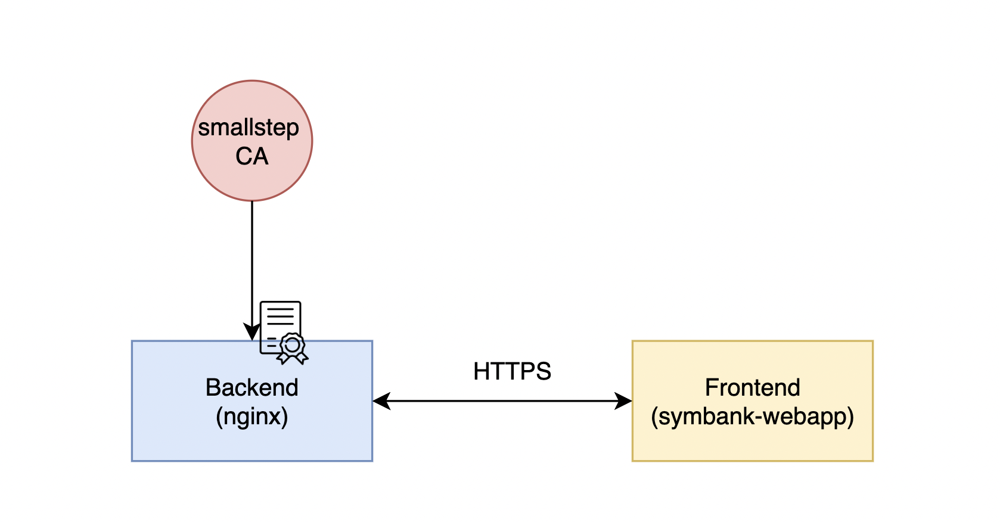

# Legacy PKI with Docker
> 
> **Environment**: Ubuntu 18.04 VM created using [mini.iso](http://archive.ubuntu.com/ubuntu/dists/bionic/main/installer-amd64/current/images/netboot/mini.iso) with SSH enabled
> 

## Prerequisites
### Installation:
- Utilities
  ```shell
  sudo apt update
  sudo apt install tmux git curl ubuntu-desktop -y
  ```
- Smallstep as our Certificate Authority (CA)
  ```shell
  # https://smallstep.com/docs/step-ca/getting-started
  wget https://dl.step.sm/gh-release/cli/docs-cli-install/v0.21.0/step-cli_0.21.0_amd64.deb
  sudo dpkg -i step-cli_0.21.0_amd64.deb
  
  wget https://dl.step.sm/gh-release/certificates/docs-ca-install/v0.21.0/step-ca_0.21.0_amd64.deb
  sudo dpkg -i step-ca_0.21.0_amd64.deb
  
  rm -f *.deb
  ```
- [mikefarah/yq](https://github.com/mikefarah/yq) to edit `yaml` inplace
  ```shell
  sudo wget https://github.com/mikefarah/yq/releases/latest/download/yq_linux_amd64 -O /usr/bin/yq
  sudo chmod +x /usr/bin/yq
  ```
### Getting Started
- Clone this repo
  ```shell
  cd ~
  git clone https://github.com/TNBL265/spiresplash.git
  ```
- Initialize Smallstep CA
  ```shell
  cd ~
  rm -rf .step
  
  # Init
  step ca init --deployment-type=standalone \
  --name spire \
  --dns localhost \
  --address 127.0.0.1:8443 \
  --provisioner [your-email-address]
  
  # Run CA (CtrlB + D to detach)
  tmux new-sess -s step-ca 'step-ca $(step path)/config/ca.json'
  ```
- Copy over root CA cert
  ```shell
  cp -R $(step path)/certs ~/spiresplash/pki/certs
  ````

## Stage 0: Microservices in Docker with TLS from a lccal Certificate Authority (Manual)
>
> Our PKI demo consists of:
> - smallstep as our CA
> - symbank-webapp frontend 
> - nginx backend serving static content over HTTPS
>


- Edit [~/spirsplash/scripts/setup-lib.sh](../scripts/setup-lib.sh) with the VM hostname, ip address and current user that you want to 
deploy the containerized applications on
  ```shell
  # vi ~/spiresplash/scripts/setup-lib.sh
  NODES=( "spire" )         # List of target node hostnames
  NODES_USER=( "spire" )     # List of target node users
  NODES_IP=( "10.0.3.2" )    # List of target node ips (should be reachable from head)
  ```
- Run setup scripts to setup ssh without password (ansible prerequisite) and ansible:
  ```shell
  cd ~/spiresplash
  
  # Setup ssh for ansible
  scripts/setup-ssh.sh
  
  # Setup ansible and create ansible user with sudo privilege
  scripts/setup-ansible.sh
  ```
- Install docker and docker-compose
  ```shell
  cd ~/spiresplash
  source ~/spiresplash/ansible_venv/bin/activate
  python3.9 -m ansible playbook \
    -i ./ansible/inventories/inventory.ini \
    -e @./ansible/inventories/overrides.yml -b -v \
    ./ansible/site.yaml -t docker
  ```
- Create private key and certificate for backend nginx TLS
  ```shell
  cd ~/spiresplash/pki/certs
  mkdir -p backend && cd backend
  step ca certificate localhost tls.crt tls.key --san=backend
  
  # Allow read permission
  sudo chmod 644 tls.*
  ```
- Build docker images and run containers using [spiresplash/pki/docker-compose.yaml](./docker-compose.yaml). 
Then check the PKI demo at http://localhost:3000
  ```shell
  cd ~/spiresplash/pki
  
  BACKEND_HOST_PORT=30443 docker-compose up --build 
  ```
## References:
- [Smallstep Getting Started](https://smallstep.com/docs/step-ca/getting-started)
- [Nginx with TLS](https://faun.pub/setting-up-ssl-certificates-for-nginx-in-docker-environ-e7eec5ebb418)
